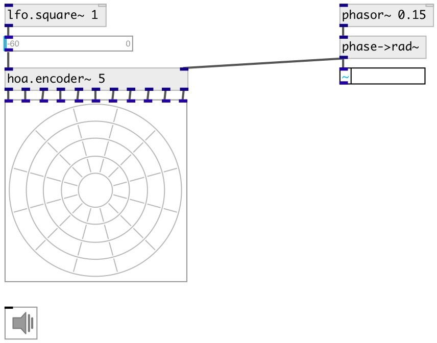

[index](index.html) :: [spat](category_spat.html)
---

# hoa.2d.encoder~
**aliases:** [hoa.encoder~]

###### hoa 2d encoder

*available since version:* 0.8

---

## information
Creates the circular harmonics of a signal depending of a given order and a position on a circle given in radians (θ).

## arguments:

* **ORDER**
the order of decomposition 
_type:_ int 

## properties:

* **@order** (readonly)
Get the order of decomposition 
_type:_ int 
_range:_ 1..63 
_default:_ 1 

## inlets:

* input signal 
_type:_ audio
* position on a circle in radians 
_type:_ audio

## outlets:

* first circular harmonics output 
_type:_ audio
* ... circular harmonics output 
_type:_ audio
* n-th circular harmonics output 
_type:_ audio

## keywords:

[hoa](keywords/hoa.html)
[encoder](keywords/encoder.html)

**See also:**
[\[hoa.2d.decoder~\]](hoa.2d.decoder~.html)

**Authors:** Serge Poltavsky, Pierre Guillot, Eliott Paris, Thomas Le Meur

**License:** GPL3 or later

