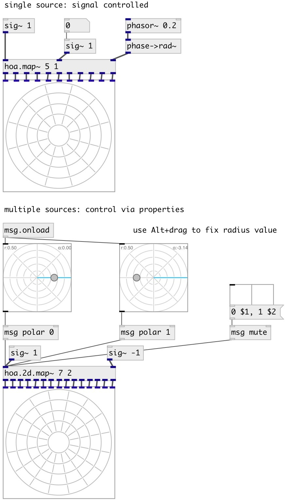

[index](index.html) :: [spat](category_spat.html)
---

# hoa.2d.map~
**aliases:** [hoa.map\~]

###### a 2d ambisonic multisource spatializer

*available since version:* 0.8

---

## information
Encodes several sources in the circular harmonics domain with distance compensation and muting system If nsrc==1 radius and angle controlled with signal values

## arguments:

* **ORDER**
the order of decomposition 
_type:_ int 

* **NSRC**
number of sources 
_type:_ int 

* **MODE**
decoding mode 
_type:_ symbol 

## methods:

* **mute**
mute/unmute specified source 
  __parameters:__
  - **IDX** source index 
    type: int  
    required: True  

  - **STATE** mute value 
    type: int  
    required: True  

* **polar**
set source mapping in polar coordinates 
  __parameters:__
  - **IDX** source index 
    type: int  
    required: True  

  - **RAD** radius 
    type: float  
    required: True  

  - **ANG** rotation angle 
    type: float  
    units: rad  
    required: True  

## properties:

* **@order** (readonly)
Get the order of decomposition 
_type:_ int 
_range:_ 1..63 
_default:_ 1 

* **@nsrc** (readonly)
Get number of input sources 
_type:_ int 
_range:_ 1..63 
_default:_ 1 

* **@ramp** 
Get/set ramp time 
_type:_ float 
_min value:_ 0 
_default:_ 100 

## inlets:

* first source input 
_type:_ audio
* ... source input 
_type:_ audio
* n-th source input 
_type:_ audio

## outlets:

* first harmonic output 
_type:_ audio
* ... harmonic output 
_type:_ audio
* n-th harmonic output 
_type:_ audio

## keywords:

[hoa](keywords/hoa.html)
[map](keywords/map.html)

**Authors:** Serge Poltavsky, Pierre Guillot, Eliott Paris, Thomas Le Meur

**License:** GPL3 or later

