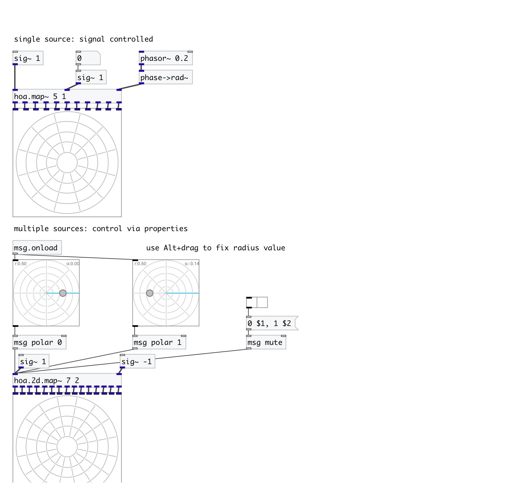

[< reference home](index.html)
---

# hoa.2d.map~

a 2d ambisonic multisource spatializer

---

Encodes several sources in the circular harmonics domain with distance
            compensation and muting system
 

---

---
arguments:

ORDER: the order of
            decomposition 
NSRC: number of sources 
MODE: decoding mode 

---
properties:

@order: the order of decomposition 
@nsrc: number of input sources 
@ramp: ramp time 

