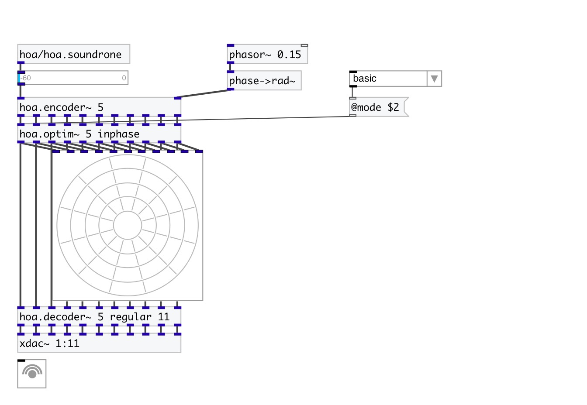

[< reference home](index.html)
---

# hoa.2d.optim~

a 2D ambisonic optimization tool

---

Weights the circular harmonics signals depending on the ambisonic optimization. It
            can be &#34;basic&#34; for no optimization, &#34;maxre&#34; or &#34;inphase&#34;.
If no optimization-mode is specified, the optimization will be inphase.
Maxre optimization is used when audience is confined to the center of the
            circle.
Inphase optimization is used when the audience covers all the circle.
NB: This is theoretical, the best choice is to trust your ears.
 

---

---
arguments:

ORDER: the order of decomposition 
MODE: optimization
            mode 

---
properties:

@order: the order of decomposition 
@mode: 
            optimization mode 
@basic: alias for @mode basic. 
@maxre: alias for @mode maxre. 
@inphase: alias for @mode inphase. 

---
see also: 

