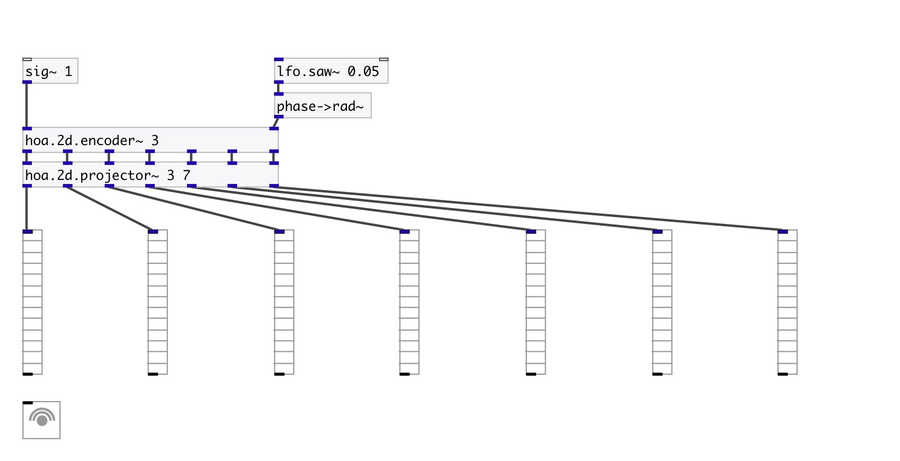

[< reference home](index.html)
---

# hoa.2d.projector~

a plane waves decomposer from circular harmonics domain

---

Discretizes the ambisonic sound field into the plane waves domain.
 

---

---
arguments:

ORDER: the order of
            decomposition 
NCH: number of
            channels 

---
properties:

@order: the order of decomposition 
@n: 
            number of channels (planewaves) 

---
see also: 

