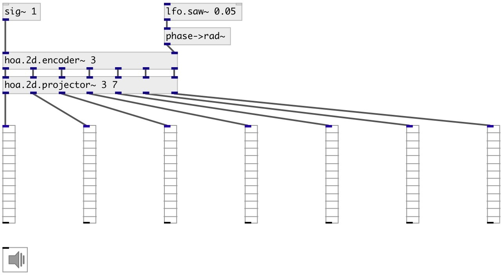

[index](index.html) :: [spat](category_spat.html)
---

# hoa.2d.projector~
**aliases:** [hoa.projector~]

###### a plane waves decomposer from circular harmonics domain

*available since version:* 0.8

---

## information
Discretizes the ambisonic sound field into the plane waves domain.

## arguments:

* **ORDER**
the order of decomposition 
_type:_ int 

* **NCH**
number of channels 
_type:_ int 

## properties:

* **@order** (readonly)
Get the order of decomposition 
_type:_ int 
_range:_ 1..63 
_default:_ 1 

* **@n** (readonly)
Get number of channels (planewaves) 
_type:_ int 
_range:_ 0..63 
_default:_ 0 

## inlets:

* input harmonic 
_type:_ audio
* ... input harmonic 
_type:_ audio
* n-th input harmonic 
_type:_ audio

## outlets:

* first plane wave output 
_type:_ audio
* ... plane wave output 
_type:_ audio
* n-th plane wave output 
_type:_ audio

## keywords:

[hoa](keywords/hoa.html)
[recomposer](keywords/recomposer.html)
[projector](keywords/projector.html)

**See also:**
[\[hoa.2d.recomposer~\]](hoa.2d.recomposer~.html)

**Authors:** Serge Poltavsky, Pierre Guillot, Eliott Paris, Thomas Le Meur

**License:** GPL3 or later

