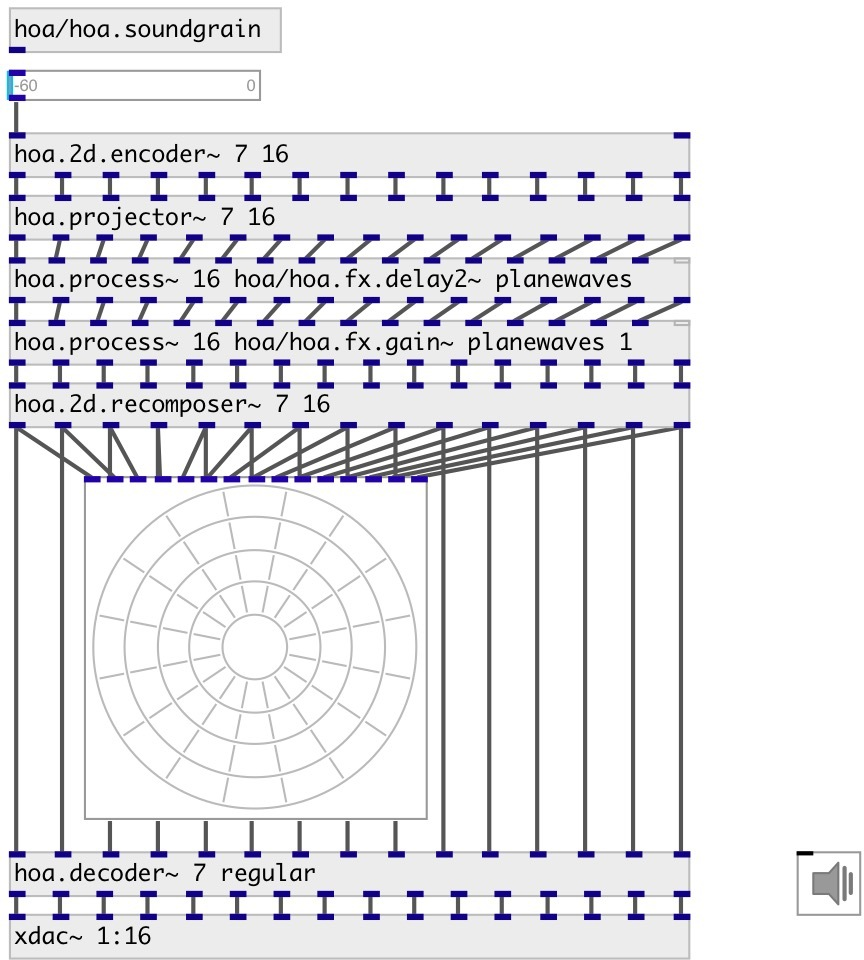

[index](index.html) :: [spat](category_spat.html)
---

# hoa.2d.recomposer~
**aliases:** [hoa.recomposer\~]

###### recomposes a 2d plane wave decomposition into circular harmonics

*available since version:* 0.8

---

## information
Recomposes a plane wave decomposition into circular harmonics. There&#39;s three modes, fixe (default), fisheye and free. The hoa.2d.recomposer~ can be controlled either by message or with the help of its dedicated graphical user interface hoa.2d.recomposer.

## arguments:

* **ORDER**
the order of decomposition 
_type:_ int 

* **NCH**
number of channels 
_type:_ int 

* **MODE**
recomposition mode. There is three modes: *fixe* - simply recomposes a plane
wave decomposition into circular harmonics. *fisheye* - allows you to perform
an operation similar to the visual &#34;fisheye&#34; effect by distorsion of the sound
field perspective to the front of the scene. *free* - allows you to change the
angles and the widening value for each channels. 
_type:_ symbol 

## methods:

* **angles**
set the angles of channels. Angles are in radians, wrapped between 0 and 2π 
  __parameters:__
  - **VALS** list of angles 
    type: list  
    units: rad  
    required: True  

* **wide**
set the widening value of channels. Widening value is clipped between 0.
(omnidirectional) and 1. (directional) 
  __parameters:__
  - **VALS** list of values per channel 
    type: list  
    required: True  

## properties:

* **@order** (readonly)
Get the order of decomposition 
_type:_ int 
_range:_ 1..63 
_default:_ 1 

* **@n** (readonly)
Get number of channels (planewaves) 
_type:_ int 
_range:_ 0..63 
_default:_ 0 

* **@mode** (readonly)
Get recomposition mode. There is three modes: *fixe* - simply recomposes a plane
wave decomposition into circular harmonics. *fisheye* - allows you to perform
an operation similar to the visual &#34;fisheye&#34; effect by distorsion of the sound
field perspective to the front of the scene. *free* - allows you to change the
angles and the widening value for each channels. 
_type:_ symbol 
_enum:_ fixe, fisheye, free 
_default:_ free 

* **@fixe** 
Get/set alias for @mode fixe 
_type:_ alias 

* **@fisheye** 
Get/set alias for @mode fisheye 
_type:_ alias 

* **@free** 
Get/set alias for @mode free 
_type:_ alias 

* **@ramp** 
Get/set ramp time 
_type:_ float 
_min value:_ 0 
_default:_ 100 

## inlets:

* input harmonic 
_type:_ audio
* input harmonic 
_type:_ audio
* input harmonic. If @fisheye mode is used: fisheye factor [0-1] in last inlet 
_type:_ audio

## outlets:

* first planewave output 
_type:_ audio
* ... planewave output 
_type:_ audio
* n-th planewave output 
_type:_ audio

## keywords:

[hoa](keywords/hoa.html)
[recomposer](keywords/recomposer.html)

**See also:**
[\[hoa.2d.projector~\]](hoa.2d.projector~.html)

**Authors:** Serge Poltavsky, Pierre Guillot, Eliott Paris, Thomas Le Meur

**License:** GPL3 or later

