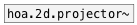

[< reference home](index.html)
---

# hoa.2d.recomposer~


recomposes a 2d plane wave decomposition into circular
            harmonics

---

Recomposes a plane wave decomposition into circular harmonics. There&#39;s three
            modes, fixe (default), fisheye and free.
The hoa.2d.recomposer~ can be controlled either by message or with the help of its
            dedicated graphical user interface hoa.2d.recomposer.
<br>


---


```


[hoa/hoa.soundgrain]
|
[ui.gain~ @size 120 14]
|
[hoa.2d.encoder~ 7 16 {w=46}]
*|*
[hoa.projector~ 7 16 {w=46,i=16,o=16}]
*|*
[hoa.process~ 16 hoa/hoa.fx.delay2~ planewaves {w=46,i=17,o=16}]
*|*
[hoa.process~ 16 hoa/hoa.fx.gain~ planewaves 1 {w=46,i=17,o=16}]
*|*
[hoa.2d.recomposer~ 7 16 {w=46,i=16,o=15}]
*|* *|*
*|* *|*
*|* [hoa.scope~ 7 @gain 4 @size 164 164 {i=15}]
*|*
*|*
*|*
*|*
*|*
*|*
*|*
*|*
*|*
*|*
*|*
[hoa.decoder~ 7 regular {w=46,i=15,o=16}] [ui.dsp~]
*|*
[xdac~ 1:16 {w=46,i=16}]

            
```

---
arguments:

ORDER: the order of
            decomposition<br>
NCH: number of
            channels<br>
MODE: recomposition mode. There
            is three modes: *fixe* - simply recomposes a plane wave decomposition into circular
            harmonics. *fisheye* - allows you to perform an operation similar to the visual
            &#34;fisheye&#34; effect by distorsion of the sound field perspective to the front of the
            scene. *free* - allows you to change the angles and the widening value for each
            channels.<br>

---
properties:

@order: the order of decomposition<br>
@n: 
            number of channels (planewaves)<br>
@mode: recomposition mode. There is three modes: *fixe* - simply recomposes a
            plane wave decomposition into circular harmonics. *fisheye* - allows you to perform an
            operation similar to the visual &#34;fisheye&#34; effect by distorsion of the sound field
            perspective to the front of the scene. *free* - allows you to change the angles and the
            widening value for each channels.<br>
@fixe: alias for @mode fixe<br>
@fisheye: alias for @mode fisheye<br>
@free: alias for @mode free<br>
@ramp: ramp time<br>

---
see also:<br>
[](hoa.2d.projector~.html)
