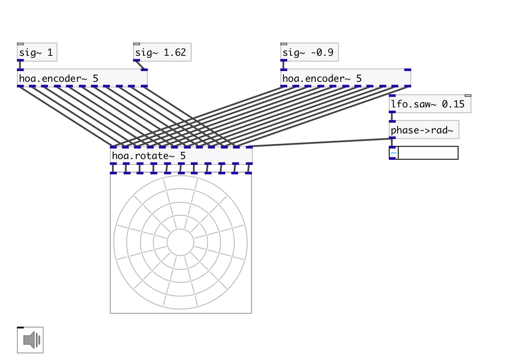

[index](index.html) :: [spat](category_spat.html)
---

# hoa.2d.rotate~
**aliases:** [hoa.rotate\~]

###### a 2D ambisonic sound field rotation

*available since version:* 0.8

---

## arguments:

* **ORDER**
the order of decomposition 
_type:_ int 

## properties:

* **@order** (readonly)
Get the order of decomposition 
_type:_ int 
_range:_ 1..63 
_default:_ 1 

## inlets:

* first input harmonic 
_type:_ audio
* ... input harmonic 
_type:_ audio
* n-th input harmonic 
_type:_ audio
* Set the angle of the rotation of the soundfield in radian. The rotation angle is anti-clockwise and wrapped between 0 and 2π. 
_type:_ audio

## outlets:

* first output harmonic 
_type:_ audio
* ... output harmonic 
_type:_ audio
* n-th output harmonic 
_type:_ audio

## keywords:

[hoa](keywords/hoa.html)
[rotate](keywords/rotate.html)

**See also:**
[\[hoa.encoder~\]](hoa.encoder~.html)

**Authors:** Serge Poltavsky, Pierre Guillot, Eliott Paris, Thomas Le Meur

**License:** GPL3 or later

