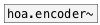

[< reference home](index.html)
---

# hoa.2d.rotate~


a 2D ambisonic sound field rotation

---

<br>


---


```


[sig~ 1]       [sig~ 1.62]        [sig~ -0.9]
|              |.                 |
[hoa.encoder~ 5 {w=21,i=11,o=11}] [hoa.encoder~ 5 {w=21,i=11,o=11}]
            *|*                   *|*
            *|*                   *|*           [lfo.saw~ 0.15]
            *|*                   *|*           |
            *|*                   *|*           [phase->rad~ #a]
            *|*                   *|*           |
            [hoa.rotate~ 5 {w=23,i=12,o=11} #b] [ui.n~]
            *|*
            [hoa.scope~ 5 @gain 4 @size 164 164 {i=11}]


[ui.dsp~]
[X a->b:11]

            
```

---
arguments:

ORDER: the order of
            decomposition<br>

---
properties:

@order: the order of decomposition<br>

---
see also:<br>
[](hoa.encoder~.html)
