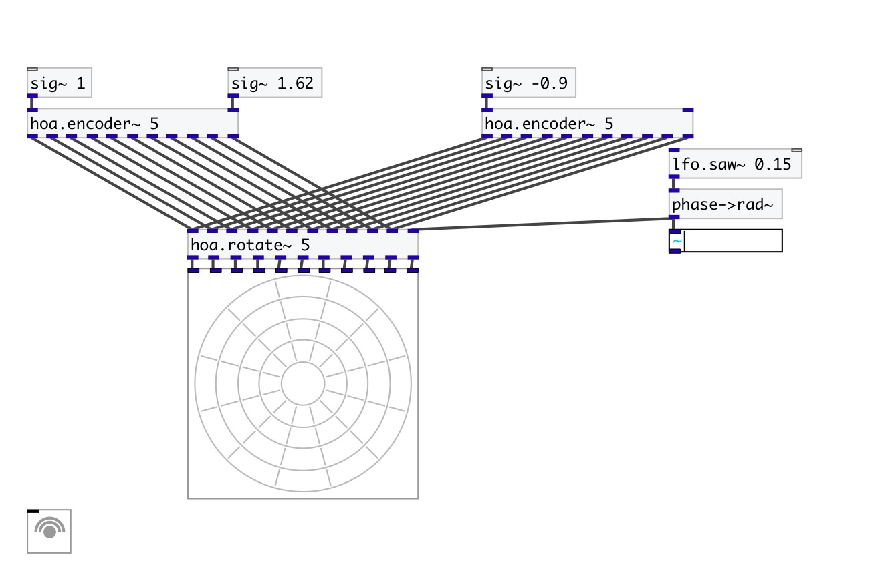

[< reference home](index.html)
---

# hoa.2d.rotate~

a 2D ambisonic sound field rotation

---

 

---

---
arguments:

ORDER: the order of
            decomposition 

---
properties:

@order: the order of decomposition 

---
see also: 

