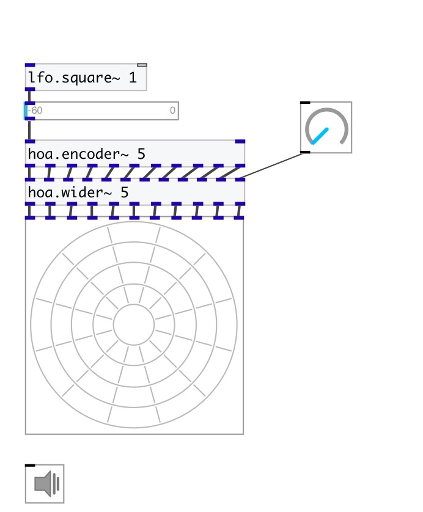

[index](index.html) :: [spat](category_spat.html)
---

# hoa.2d.wider~

###### a 2d fractional ambisonic order simulator

*available since version:* 0.8

---

## information
hoa.2d.wider~ can be used to wide the diffusion of a localised sound. The order
            depending signals are weighted and appear in a logarithmic way to have linear
            changes.

## arguments:

* **ORDER**
the order of decomposition 
__type:__ int 

## properties:

* **@order** (readonly)
Get the order of decomposition 
__type:__ int 
__range:__ 1..63 
__default:__ 1 

## inlets:

* first input signal 
__type:__ audio 
* ... input signal 
__type:__ audio 
* n-th input signal 
__type:__ audio 
* widening signal in [0-1] range. 
__type:__ audio 

## outlets:

* first circular harmonics output
__type:__ audio 
* ... circular harmonics output
__type:__ audio 
* n-th circular harmonics output
__type:__ audio 

## keywords:

[hoa](keywords/hoa.html)
[wider](keywords/wider.html)

**Authors:** Serge Poltavsky, Pierre Guillot, Eliott Paris, Thomas Le Meur

**License:** GPL3 or later

