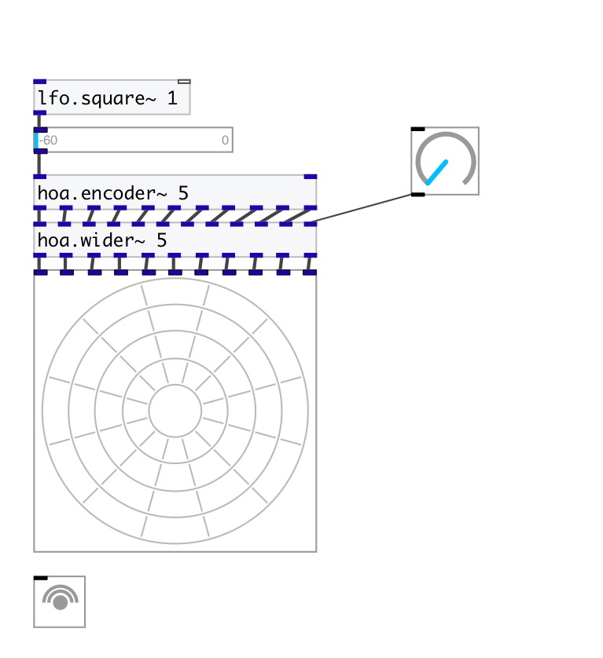

[< reference home](index.html)
---

# hoa.2d.wider~

a 2d fractional ambisonic order simulator

---

hoa.2d.wider~ can be used to wide the diffusion of a localised sound. The order
            depending signals are weighted and appear in a logarithmic way to have linear
            changes.
 

---

---
arguments:

ORDER: the order of
            decomposition 

---
properties:

@order: the order of decomposition 

