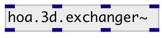

[index](index.html) :: [spat](category_spat.html)
---

# hoa.3d.exchanger~

###### renumbers and normalizes the channels

*available since version:* 0.9.7

---

## information
The library default normalization is SN3D and the numbering is ACN (cf tutorials). The exchangers will always convert from or to the standard.

## arguments:

* **ORDER**
the order of decomposition 
_type:_ int 

* **NUM**
numbering scheme 
_type:_ symbol 

* **NORM**
normalization 
_type:_ symbol 

## properties:

* **@order** (initonly)
Get/set the order of decomposition 
_type:_ int 
_range:_ 1..10 
_default:_ 1 

* **@num** 
Get/set numbering scheme 
_type:_ symbol 
_enum:_ ACN, fromFurseMalham, fromSID, toFurseMalham, toSID 
_default:_ ACN 

* **@norm** 
Get/set normalization 
_type:_ symbol 
_enum:_ SN3D, fromMaxN, fromN3D, toMaxN, toN3D 
_default:_ SN3D 

* **@toB** 
Get/set alias to @num toFurseMalham and @norm toMaxN 
_type:_ alias 

* **@toDaniel** 
Get/set alias to @num toSID and @norm toN3D 
_type:_ alias 

* **@fromB** 
Get/set alias to @num fromFurseMalham and @norm fromMaxN 
_type:_ alias 

* **@fromDaniel** 
Get/set alias to @num fromSID and @norm fromN3D 
_type:_ alias 

## inlets:

* first input harmonic 
_type:_ audio
* ... input harmonic 
_type:_ audio
* n-th input harmonic 
_type:_ audio

## outlets:

* first loudspeaker output 
_type:_ audio
* ... loudspeaker output 
_type:_ audio
* n-th loudspeaker output 
_type:_ audio

## keywords:

[hoa](keywords/hoa.html)
[exchanger](keywords/exchanger.html)

**See also:**
[\[hoa.2d.exchanger~\]](hoa.2d.exchanger~.html)

**Authors:** Serge Poltavsky, Pierre Guillot, Eliott Paris, Thomas Le Meur

**License:** GPL3 or later

