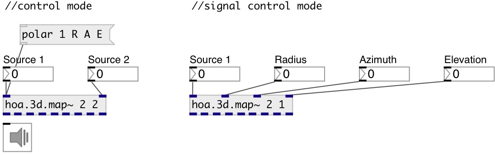

[index](index.html) :: [spat](category_spat.html)
---

# hoa.3d.map~

###### a 3d ambisonic multisource spatializer

*available since version:* 0.9.7

---

## information
Encodes several sources in the circular harmonics domain with distance compensation and muting system If @nsrc 1: radius, azimuth and elevation are controlled with signal values Note: source indexes are 1-based.

## arguments:

* **ORDER**
the order of decomposition 
_type:_ int 

* **NSRC**
number of sources 
_type:_ int 

* **MODE**
coordinates mode 
_type:_ symbol 

## methods:

* **mute**
mute/unmute specified source 
  __parameters:__
  - **IDX** source index. 1-based 
    type: int  
    required: True  

  - **STATE** mute value 
    type: int  
    required: True  

* **polar**
set source mapping in polar coordinates 
  __parameters:__
  - **IDX** source index. 1-based 
    type: int  
    required: True  

  - **RAD** radius 
    type: float  
    required: True  

  - **AZIM** azimuth angle 
    type: float  
    units: rad  
    required: True  

  - **ELEV** elevation 
    type: float  
    units: rad  
    required: True  

* **cartesian**
set source mapping in cartesian coordinates 
  __parameters:__
  - **IDX** source index. 1-based 
    type: int  
    required: True  

  - **X** x coordinate 
    type: float  
    required: True  

  - **Y** y coordinate 
    type: float  
    required: True  

  - **Z** z coordinate 
    type: float  
    required: True  

* **pol**
alias to polar method 

* **car**
alias to cartesian method 

## properties:

* **@order** (initonly)
Get/set the order of decomposition 
_type:_ int 
_range:_ 1..10 
_default:_ 1 

* **@nsrc** (initonly)
Get/set number of input sources 
_type:_ int 
_min value:_ 1 
_default:_ 1 

* **@ramp** 
Get/set ramp time 
_type:_ float 
_min value:_ 0 
_default:_ 100 

* **@mode** 
Get/set coordinates mode in signal control mode (with @nsrc 1), polar or cartesian 
_type:_ symbol 
_enum:_ car, pol 
_default:_ pol 

## inlets:

* first source input 
_type:_ audio
* ... source input 
_type:_ audio
* n-th source input 
_type:_ audio

## outlets:

* first harmonic output 
_type:_ audio
* ... harmonic output 
_type:_ audio
* n-th harmonic output 
_type:_ audio

## keywords:

[hoa](keywords/hoa.html)
[map](keywords/map.html)
[3d](keywords/3d.html)

**Authors:** Serge Poltavsky, Pierre Guillot, Eliott Paris, Thomas Le Meur

**License:** GPL3 or later

