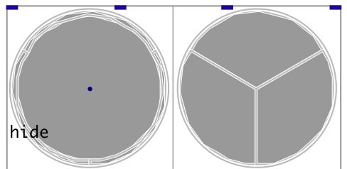

[index](index.html) :: [spat](category_spat.html)
---

# hoa.3d.meter~

###### multi spherical meter with sound field descriptor

*available since version:* 0.9.7

---

## information
displays the peak levels for a spherical array of loudspeakers. It computes and displays the energy and velocity vectors.

## methods:

* **pos**
set UI element position 
  __parameters:__
  - **X** top left x-coord 
    type: float  
    required: True  

  - **Y** top right y-coord 
    type: float  
    required: True  

## properties:

* **@channels** 
Get/set number of input channels 
_type:_ int 
_range:_ 1..64 
_default:_ 4 

* **@send** 
Get/set send destination 
_type:_ symbol 
_default:_ (null) 

* **@receive** 
Get/set receive source 
_type:_ symbol 
_default:_ (null) 

* **@size** 
Get/set element size (width, height pair) 
_type:_ list 
_default:_ 225 225 

* **@pinned** 
Get/set pin mode. if 1 - put element to the lowest level 
_type:_ bool 
_default:_ 0 

* **@background_color** 
Get/set element background color (list of red, green, blue values in 0-1 range) 
_type:_ list 
_default:_ 0.93 0.93 0.93 1 

* **@border_color** 
Get/set border color (list of red, green, blue values in 0-1 range) 
_type:_ list 
_default:_ 0.6 0.6 0.6 1 

* **@fontsize** 
Get/set fontsize 
_type:_ int 
_range:_ 4..100 
_default:_ 11 

* **@fontname** 
Get/set fontname 
_type:_ symbol 
_enum:_ Courier, DejaVu, Helvetica, Monaco, Times 
_default:_ Helvetica 

* **@fontweight** 
Get/set font weight 
_type:_ symbol 
_enum:_ normal, bold 
_default:_ normal 

* **@fontslant** 
Get/set font slant 
_type:_ symbol 
_enum:_ roman, italic 
_default:_ roman 

* **@over_color** 
Get/set peak overload color 
_type:_ list 
_default:_ 1 0 0 0.8 

* **@hot_color** 
Get/set color for &gt;=-12db. 
_type:_ list 
_default:_ 1 0.6 0 0.8 

* **@warm_color** 
Get/set color for &gt;=-21db. 
_type:_ list 
_default:_ 0.85 0.85 0 0.8 

* **@tepid_color** 
Get/set color for &gt;=-30db. 
_type:_ list 
_default:_ 0.6 0.73 0 0.8 

* **@cold_color** 
Get/set color for &gt;=-39db. 
_type:_ list 
_default:_ 0 0.6 0 0.8 

* **@energy_color** 
Get/set energy vector color 
_type:_ list 
_default:_ 0 0 1 0.8 

* **@velocity_color** 
Get/set velocity vector 
_type:_ list 
_default:_ 1 0 0 0.8 

* **@label** 
Get/set label text 
_type:_ symbol 
_default:_ (null) 

* **@label_color** 
Get/set label color in RGB format within 0-1 range, for example: 0.2 0.4 0.1 
_type:_ list 
_default:_ 0 0 0 1 

* **@label_inner** 
Get/set label position (1 - inner, 0 - outer). 
_type:_ bool 
_default:_ 0 

* **@label_align** 
Get/set label horizontal align 
_type:_ symbol 
_enum:_ left, center, right 
_default:_ left 

* **@label_valign** 
Get/set label vertical align 
_type:_ symbol 
_enum:_ top, center, bottom 
_default:_ top 

* **@label_side** 
Get/set label snap side 
_type:_ symbol 
_enum:_ left, top, right, bottom 
_default:_ top 

* **@label_margins** 
Get/set label offset in pixels 
_type:_ list 
_default:_ 0 0 

* **@interval** 
Get/set refresh interval 
_type:_ int 
_units:_ ms 
_range:_ 20..1000 
_default:_ 50 

* **@clockwise** 
Get/set clockwise channel numbering mode 
_type:_ bool 
_default:_ 0 

* **@offset** 
Get/set channel numbering offset for each axes 
_type:_ list 
_default:_ 0 0 0 

* **@angles** 
Get/set channel layout angles 
_type:_ list 
_default:_ 0 90 0 -19.5 120 -19.5 240 -19.5 

* **@vectors** 
Get/set vector display mode 
_type:_ symbol 
_enum:_ both, energy, none, velocity 
_default:_ energy 

* **@view** 
Get/set view mode 
_type:_ symbol 
_enum:_ bottom, top, topnextbottom, toponbottom 
_default:_ top 

## inlets:

* first source input 
_type:_ audio
* ... source input 
_type:_ audio
* n-th source input 
_type:_ audio

## outlets:

* first harmonic output 
_type:_ audio
* ... harmonic output 
_type:_ audio
* n-th harmonic output 
_type:_ audio

## keywords:

[hoa](keywords/hoa.html)
[meter](keywords/meter.html)
[3d](keywords/3d.html)

**Authors:** Serge Poltavsky, Pierre Guillot, Eliott Paris, Thomas Le Meur

**License:** GPL3 or later

