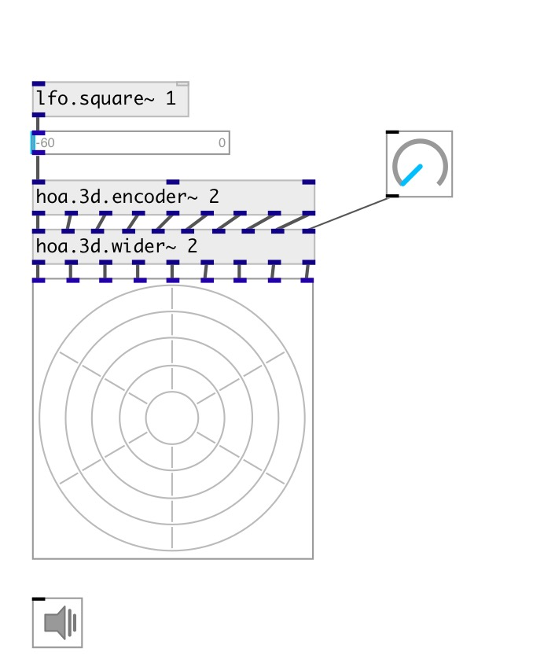

[index](index.html) :: [spat](category_spat.html)
---

# hoa.3d.wider~

###### a 3d fractional ambisonic order simulator

*available since version:* 0.9.7

---

## information
hoa.3d.wider~ can be used to wide the diffusion of a localised sound. The order depending signals are weighted and appear in a logarithmic way to have linear changes.

## arguments:

* **ORDER**
the order of decomposition 
_type:_ int 

## properties:

* **@order** (initonly)
Get/set the order of decomposition 
_type:_ int 
_range:_ 1..10 
_default:_ 1 

## inlets:

* first input signal 
_type:_ audio
* ... input signal 
_type:_ audio
* n-th input signal 
_type:_ audio
* widening signal in [0-1] range. 
_type:_ audio

## outlets:

* first circular harmonics output 
_type:_ audio
* ... circular harmonics output 
_type:_ audio
* n-th circular harmonics output 
_type:_ audio

## keywords:

[hoa](keywords/hoa.html)
[wider](keywords/wider.html)

**Authors:** Serge Poltavsky, Pierre Guillot, Eliott Paris, Thomas Le Meur

**License:** GPL3 or later

