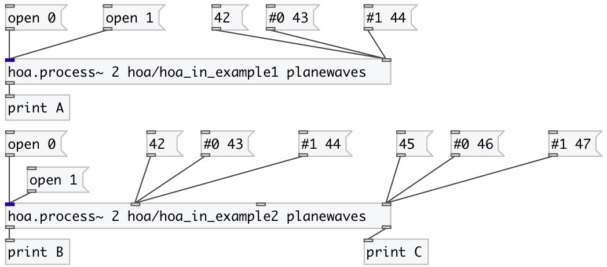

[index](index.html) :: [spat](category_spat.html)
---

# hoa.in

###### message inlet for a patcher loaded by hoa.process~

*available since version:* 0.8

---

## information
hoa.in defines a message inlet for a patcher loaded by a hoa.process~ object.

## arguments:

* **INDEX**
shortcut for @index property 
_type:_ int 

## properties:

* **@index** 
Get/set Defines an inlet index 
_type:_ int 
_min value:_ 1 
_default:_ 1 

## outlets:

* output messages received from a hoa.process~ input. 
_type:_ control

## keywords:

[hoa](keywords/hoa.html)
[inlet](keywords/inlet.html)

**See also:**
[\[hoa.in~\]](hoa.in~.html)
[\[hoa.out\]](hoa.out.html)
[\[hoa.out~\]](hoa.out~.html)

**Authors:** Serge Poltavsky, Pierre Guillot, Eliott Paris, Thomas Le Meur

**License:** GPL3 or later

