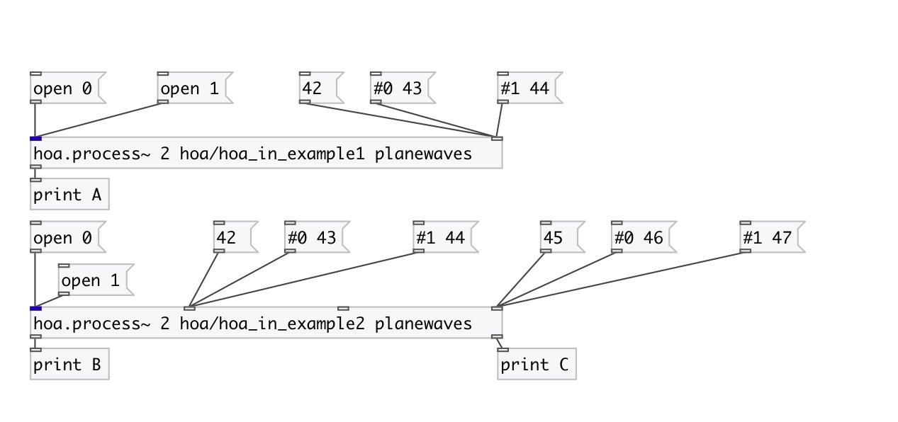

[< reference home](index.html)
---

# hoa.in

message inlet for a patcher loaded by hoa.process~

---

hoa.in defines a message inlet for a patcher loaded by a hoa.process~
            object.
 

---

---
arguments:

INDEX: shortcut for @index property 

---
properties:

@index: Defines an inlet
            index 

---
see also: 

