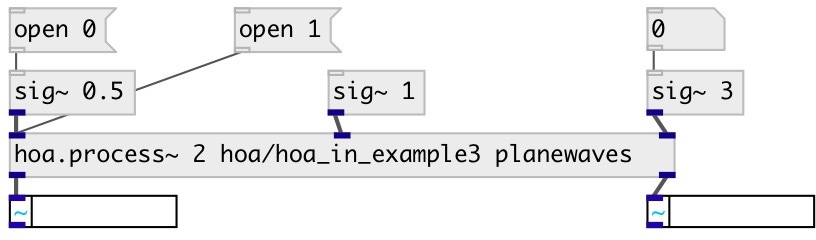

[index](index.html) :: [spat](category_spat.html)
---

# hoa.in~

###### signal inlet for a patcher loaded by hoa.process~

*available since version:* 0.8

---

## information
defines a signal inlet for a patcher loaded by a hoa.process~ object

## arguments:

* **EXTRA**
shortcut for @extra property 
_type:_ int 

## properties:

* **@extra** 
Get/set extra inlet. Extra inlet are added to the &#34;normal&#34; instance inlet and can be
used to send signal to all instances 
_type:_ int 
_min value:_ 0 
_default:_ 0 

## outlets:

* output signal from a hoa.process~ object&#39;s inlet 
_type:_ audio

## keywords:

[hoa](keywords/hoa.html)
[inlet](keywords/inlet.html)

**See also:**
[\[hoa.in\]](hoa.in.html)
[\[hoa.out\]](hoa.out.html)
[\[hoa.out~\]](hoa.out~.html)

**Authors:** Serge Poltavsky, Pierre Guillot, Eliott Paris, Thomas Le Meur

**License:** GPL3 or later

