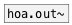

[<<< reference home](ceammc_lib.md)
---

# hoa.out

```


[open 0( [open 1(  [42( [\#0 43( [\#1 44(
|        |         |    |        |
|        |         |.   |.       |.
[hoa.process~ 2 hoa/hoa_in_example1 planewaves]
|
[print A]

[open 0(     [42( [\#0 43( [\#1 44( [45( [\#0 46( [\#1 47(
|            |    |        |        |    |        |
| [open 1(   |    |        |        |    |        |
| |          |.   |.       |.       |... |...     |...
[hoa.process~ 2 hoa/hoa_in_example2 planewaves       ]
|                                ^|
[print B]                        [print C]

            
```
---
message outlet for a patcher loaded by hoa.process~
---
arguments:

INDEX: outlet index<br>

---
properties:

@index: outlet index<br>

---
see also:<br>
[](hoa.out~.md)
[](hoa.in.md)
[](hoa.in~.md)
