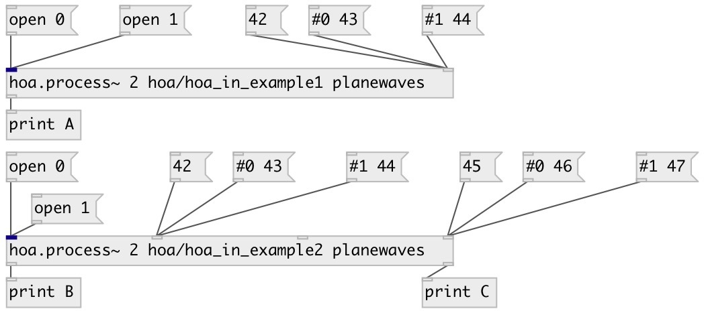

[index](index.html) :: [spat](category_spat.html)
---

# hoa.out

###### message outlet for a patcher loaded by hoa.process~

*available since version:* 0.8

---

## information
hoa.out defines a message outlet for a patcher loaded by a hoa.process~
            object.

## arguments:

* **INDEX**
outlet index 
_type:_ int 

## properties:

* **@index** 
Get/set outlet index 
_type:_ int 
_min value:_ 1 
_default:_ 1 

## inlets:

* output bang message in the corresponding hoa.process~ object&#39;s message outlet 
_type:_ control

## keywords:

[hoa](keywords/hoa.html)
[outlet](keywords/outlet.html)

**See also:**
[\[hoa.out~\]](hoa.out~.html)
[\[hoa.in\]](hoa.in.html)
[\[hoa.in~\]](hoa.in~.html)

**Authors:** Serge Poltavsky, Pierre Guillot, Eliott Paris, Thomas Le Meur

**License:** GPL3 or later

