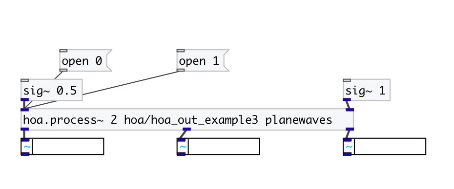

[< reference home](index.html)
---

# hoa.out~

signal inlet for a patcher loaded by hoa.process~

---

defines a signal outlet for a patcher loaded by a hoa.process~ object
 

---

---
arguments:

EXTRA: shortcut for @extra property 

---
properties:

@extra: extra inlet. Extra inlet
            are added to the &#34;normal&#34; instance inlet and can be used to send signal to all
            instances 

---
see also: 

