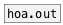
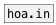

[< reference home](ceammc_lib.html)
---

# hoa.out~


signal inlet for a patcher loaded by hoa.process~

```


    [open 0 #a( [open 1 #b(

[sig~ 0.5]                       [sig~ 1]
|                                |.
[hoa.process~ 2 hoa/hoa_out_example3 planewaves #z]
|               ^|               ^^|
[ui.n~]         [ui.n~]          [ui.n~]

[X a->z]
[X b->z]

            
```

---
arguments:

EXTRA: shortcut for @extra property<br>

---
properties:

@extra: extra inlet. Extra inlet
            are added to the &#34;normal&#34; instance inlet and can be used to send signal to all
            instances<br>

---
see also:<br>
[](hoa.out.html)
[](hoa.in.html)
[](hoa.in~.html)
