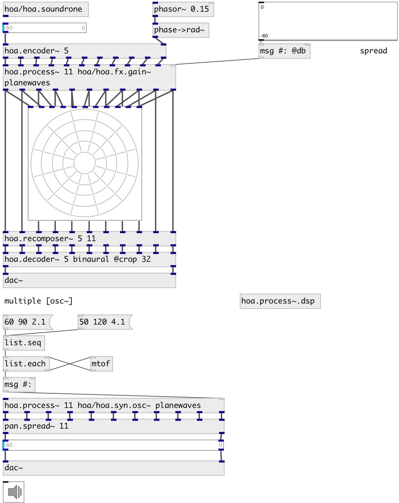

[index](index.html) :: [spat](category_spat.html)
---

# hoa.process~
**aliases:** [hoa.2d.process\~], [hoa.3d.process\~]

###### patcher loader for multichannel processing

*available since version:* 0.8

---

## information
hoa.process~ helps the modularization of patches for ambisonic or plane waves processing. hoa.process~ is a kind of poly~ object particulary suitable for multichannel ambisonic or plane wave processing. Create a patch/effect/operator, then parallelize it with the hoa.process~ Target selector examples: #* send to all instances #: send list values spreaded amoung all instances, one value per instance #:2 send list values spreaded amoung instances with id&gt;=2 #1 send to second instance #&lt;2 send to instance #0 and #1 #&gt;2 send to instances with id&gt;2 #2-4 send to instances with id in [2, 4] range

## arguments:

* **N**
the order of decomposition 
_type:_ int 

* **PATCH**
patch name 
_type:_ symbol 

* **DOMAIN**
process domain: harmonics or planewaves 
_type:_ symbol 

* **ARGS**
instance arguments 
_type:_ list 

## methods:

* **dump**
dumps all object info to Pd console window. 

* **on**
switch on/off DSP instance processing. Usage: on all 0|1 - turn on/off all
instances, on IDX 0|1 - turn on/off specified instance. 

* **open**
open Pd window for specified instance 
  __parameters:__
  - **IDX** instance index 
    type: int  
    required: True  

## properties:

* **@n** (initonly)
Get/set the order of decomposition/number of planewaves 
_type:_ int 
_range:_ 0..63 
_default:_ 0 

* **@patch** (initonly)
Get/set patch name 
_type:_ symbol 

* **@domain** (initonly)
Get/set process domain: harmonics or planewaves 
_type:_ symbol 
_enum:_ harmonics, planewaves 
_default:_ harmonics 

* **@args** (initonly)
Get/set arguments passed to instances 
_type:_ list 

## inlets:

* first input harmonic/planewave 
_type:_ audio
* ... input harmonic/planewave 
_type:_ audio
* n-th input harmonic/planewave 
_type:_ audio

## outlets:

* first harmonic/planewave output 
_type:_ audio
* ... harmonic/planewave output 
_type:_ audio
* n-th harmonic/planewave output 
_type:_ audio

## keywords:

[hoa](keywords/hoa.html)
[process](keywords/process.html)
[2d](keywords/2d.html)

**See also:**
[\[hoa.2d.decoder~\]](hoa.2d.decoder~.html)

**Authors:** Serge Poltavsky, Pierre Guillot, Eliott Paris, Thomas Le Meur

**License:** GPL3 or later

