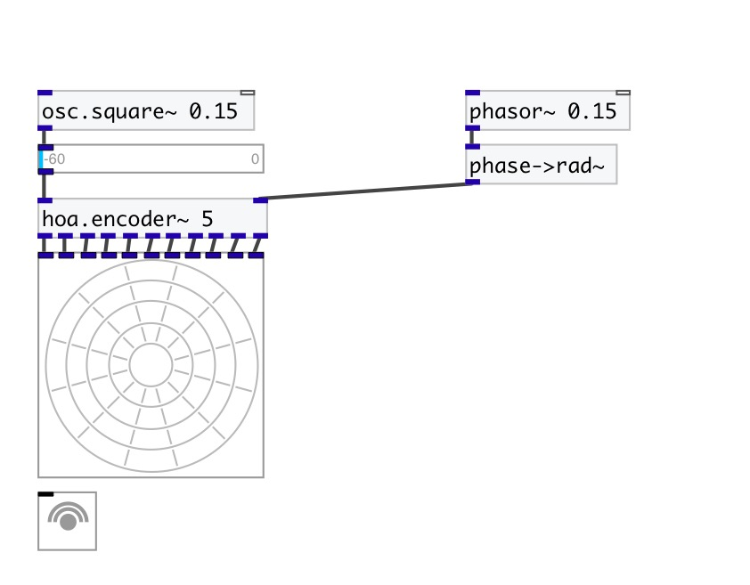

[< reference home](index.html)
---

# hoa.scope~

a 2d ambisonic harmonic scope

---

displays the circular harmonics of an ambisonic sound field
 

---

---
arguments:

ORDER: the order of decomposition 

---
properties:

@order: the order of decomposition 
@view: view rotation 
@gain: gain 
@refresh(ms): redraw time 
@ph_color: positive harmonics
            color 
@nh_color: negative harmonics
            color 
@send: send destination 
@receive: receive source 
@size: element size (width, height
            pair) 
@pinned: pin mode. if 1 - put element
            to the lowest level 
@background_color: element
            background color (list of red, green, blue values in 0-1 range) 
@border_color: border color (list
            of red, green, blue values in 0-1 range) 
@fontsize: 
            fontsize 
@fontname: fontname 
@fontweight: font
            weight 
@fontslant: font
            slant 
@label: label text 
@label_color: label color in RGB format
            within 0-1 range, for example: 0.2 0.4 0.1 
@label_inner: label position (1 -
            inner, 0 - outer). 
@label_align: 
            label horizontal align 
@label_valign: 
            label vertical align 
@label_side: 
            label snap side 
@label_margins: label offset in
            pixels 

