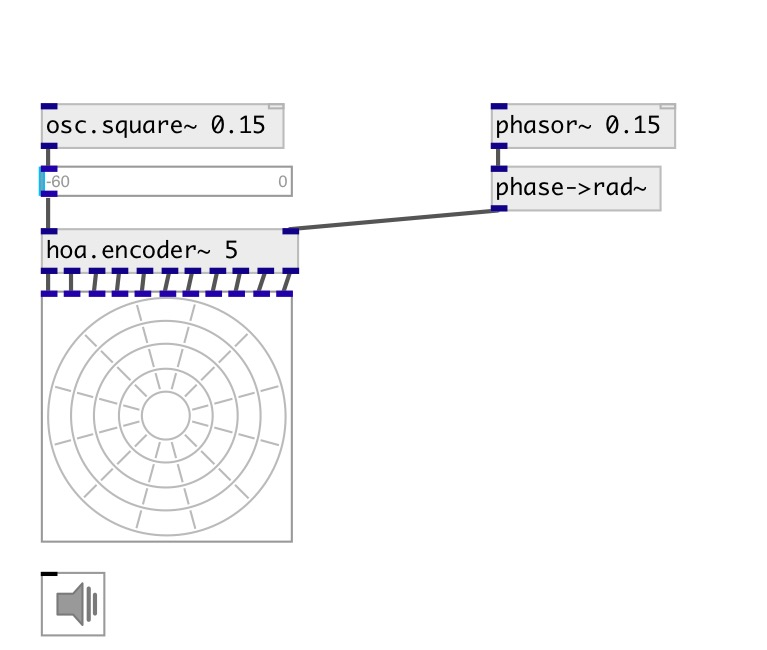

[index](index.html) :: [spat](category_spat.html)
---

# hoa.scope~

###### a 2d ambisonic harmonic scope

*available since version:* 0.8

---

## information
displays the circular harmonics of an ambisonic sound field

## arguments:

* **ORDER**
the order of decomposition 
__type:__ int 

## methods:

* **dump**
dumps all object info to Pd console window. 

* **pos**
set UI element position 
  __parameters:__
  - **X** top left x-coord 
    type: float  
    required: True  

  - **Y** top right y-coord 
    type: float  
    required: True  

## properties:

* **@order** (readonly)
Get the order of decomposition 
__type:__ int 
__range:__ 1..63 
__default:__ 1 

* **@view** 
Get/set view rotation 
__type:__ float 
__default:__ 0 

* **@gain** 
Get/set gain 
__type:__ float 
__min value:__ 0 
__default:__ 1 

* **@refresh** 
Get/set redraw time 
__type:__ int 
__units:__ ms 
__range:__ 20..1000 
__default:__ 100 

* **@ph_color** 
Get/set positive harmonics color 
__type:__ list 
__default:__ 1 0 0 1 

* **@nh_color** 
Get/set negative harmonics color 
__type:__ list 
__default:__ 0 0 1 1 

* **@send** 
Get/set send destination 
__type:__ symbol 
__default:__ (null) 

* **@receive** 
Get/set receive source 
__type:__ symbol 
__default:__ (null) 

* **@size** 
Get/set element size (width, height pair) 
__type:__ list 
__default:__ 120 120 

* **@pinned** 
Get/set pin mode. if 1 - put element to the lowest level 
__type:__ int 
__enum:__ 0, 1 
__default:__ 0 

* **@background_color** 
Get/set element background color (list of red, green, blue values in 0-1 range) 
__type:__ list 
__default:__ 0.93 0.93 0.93 1 

* **@border_color** 
Get/set border color (list of red, green, blue values in 0-1 range) 
__type:__ list 
__default:__ 0.6 0.6 0.6 1 

* **@fontsize** 
Get/set fontsize 
__type:__ int 
__range:__ 4..11 
__default:__ 11 

* **@fontname** 
Get/set fontname 
__type:__ symbol 
__default:__ Helvetica 

* **@fontweight** 
Get/set font weight 
__type:__ symbol 
__enum:__ normal, bold 
__default:__ normal 

* **@fontslant** 
Get/set font slant 
__type:__ symbol 
__enum:__ roman, italic 
__default:__ roman 

* **@label** 
Get/set label text 
__type:__ symbol 
__default:__ (null) 

* **@label_color** 
Get/set label color in RGB format within 0-1 range, for example: 0.2 0.4 0.1 
__type:__ list 
__default:__ 0 0 0 1 

* **@label_inner** 
Get/set label position (1 - inner, 0 - outer). 
__type:__ int 
__enum:__ 0, 1 
__default:__ 0 

* **@label_align** 
Get/set label horizontal align 
__type:__ symbol 
__enum:__ left, center, right 
__default:__ left 

* **@label_valign** 
Get/set label vertical align 
__type:__ symbol 
__enum:__ top, center, bottom 
__default:__ top 

* **@label_side** 
Get/set label snap side 
__type:__ symbol 
__enum:__ left, top, right, bottom 
__default:__ top 

* **@label_margins** 
Get/set label offset in pixels 
__type:__ list 
__default:__ 0 0 

## inlets:

* first input harmonic 
__type:__ audio 
* ... input harmonic 
__type:__ audio 
* n-th input harmonic 
__type:__ audio 

## keywords:

[hoa](keywords/hoa.html)
[scope](keywords/scope.html)

**Authors:** Serge Poltavsky, Pierre Guillot, Eliott Paris, Thomas Le Meur

**License:** GPL3 or later

