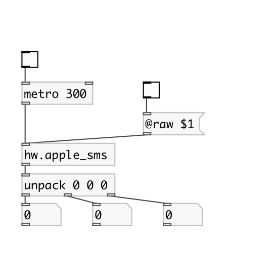

[< reference home](index.html)
---

# hw.apple_sms

query the sudden motion sensor in Apples

---

In raw output mode output values can be in various output range and sign,
            otherwise output data are normalized to float range, where positive *x* mean
            rightwards, positive *y* means rearwards, positive *z* mean upwards, but not all
            devices are in database. It it occures with your device (wrong direction), please, send
            us this information
 

---

---
arguments:

---
properties:

@raw: raw data output mode 

