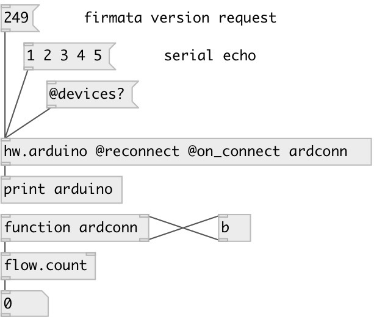

[index](index.html) :: [hw](category_hw.html)
---

# hw.arduino

###### Arduino device

*available since version:* 0.5

---

## information
Arduino serial port tha t supports reconnect and hotplug. If no properties are given tries to connect to first available and not opened device. If @reconnect flag is given, waits for device hotplug and reconnects to it.

## arguments:

* **PORT**
serial port name, eg.: COM3 on Windows, /dev/ttyACM0 on Linux and
/dev/cu.usbmodem411 on MacOSX 
_type:_ symbol 

* **RATE**
serial baud rate 
_type:_ int 

## methods:

* **connect**
manually connect to device 

* **disconnect**
disconnect from device 

## properties:

* **@port** (initonly)
Get/set name of arduino serial port, eg.: COM3 on Windows, /dev/ttyACM0 on Linux and
/dev/cu.usbmodem411 on MacOSX. If specified on creation tries to connect to
this device only 
_type:_ symbol 

* **@serial** 
Get/set USB device serial number. If specified at creation, tries to connect to devices
only with such serial number 
_type:_ symbol 

* **@rate** 
Get/set serial baud rate. Standard value supported by most serial ports: 110, 300, 600,
1200, 2400, 4800, 9600, 14400, 19200, 28800, 38400, 56000, 57600, 115200 
_type:_ int 
_enum:_ 57600, 110, 300, 600, 1200, 2400, 4800, 9600, 14400, 19200, 38400, 56000, 115200, 128000, 256000 
_default:_ 57600 

* **@vendor_id** 
Get/set USB device vendor id. If specified at creation, tries to connect to devices
only with such vendor. Note: vendor id is specified in decimal mode, not in hex 
_type:_ int 
_default:_ 0 

* **@product_id** 
Get/set USB device product id. If vendor and product ids are specified at creation,
tries to connect to devices only with such properties. Note: product id is
specified in decimal mode, not in hex 
_type:_ int 
_default:_ 0 

* **@reconnect** (initonly)
Get/set enables hot-pluggin 
_type:_ flag 
_default:_ 0 

* **@connected** (readonly)
Get state of connection to device 
_type:_ bool 
_default:_ 0 

* **@devices** (readonly)
Get list of found Arduino devices 
_type:_ list 

* **@on_connect** 
Get/set function called every time on connect 
_type:_ symbol 

## inlets:

* sends float value in byte range [0-255] to arduino device 
_type:_ control

## outlets:

* outputs received byte from arduino 
_type:_ control

## keywords:

[arduino](keywords/arduino.html)

**Authors:** Serge Poltavsky

**License:** GPL3 or later

