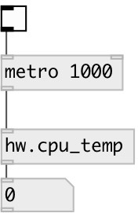

[index](index.html) :: [hw](category_hw.html)
---

# hw.cpu_temp

###### get CPU temperature

*available since version:* 0.8

---

## information
At this moment supports only MacOSX

## inlets:

* outputs current CPU temperature 
_type:_ control

## outlets:

* float value in celsius degree 
_type:_ control

## keywords:

[motion](keywords/motion.html)
[sensor](keywords/sensor.html)

**Authors:** Serge Poltavsky

**License:** GPL3 or later

