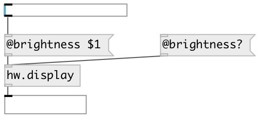

[index](index.html) :: [hw](category_hw.html)
---

# hw.display

###### get/set display properties

*available since version:* 0.7.1

---

## information
At this moment supports only MacOSX

## properties:

* **@brightness** 
Get/set display brightness 
_type:_ float 
_range:_ 0..1 
_default:_ 0.313477 

## inlets:

* input 
_type:_ control

## outlets:

* properties output 
_type:_ control

## keywords:

[display](keywords/display.html)
[brightness](keywords/brightness.html)

**Authors:** Serge Poltavsky

**License:** GPL3 or later

