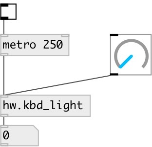

[index](index.html) :: [hw](category_hw.html)
---

# hw.kbd_light

###### Get/set keyboard light on some devices

*available since version:* 0.8

---

## information
Only Apple keyboards are supported at this moment

## inlets:

* sets current keyboards light level (no
                output) 
__type:__ control 

## outlets:

* keyboard light level in range 0...1
__type:__ control 

## keywords:

[keyboard](keywords/keyboard.html)

**Authors:** Serge Poltavsky, Hans-Christoph Steiner

**License:** GPL3 or later

