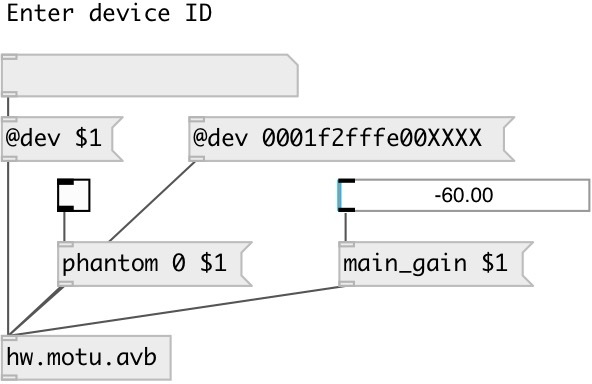

[index](index.html) :: [hw](category_hw.html)
---

# hw.motu.avb

###### controls Motu AVB devices over http requests

*available since version:* 0.9.5

---

## information
Only basic support at this moment

## arguments:

* **ID**
Motu device id 
_type:_ symbol 

## methods:

* **main_gain**
set main output gain 
  __parameters:__
  - **DB** value in decibel 
    type: float  
    units: db  
    required: True  

* **phones_gain**
set phones output gain 
  __parameters:__
  - **DB** value in decibel 
    type: float  
    units: db  
    required: True  

* **phantom**
turns phantom on/off 
  __parameters:__
  - **CHAN** phantom channel 
    type: int  
    required: True  

  - **VAL** phantom state 
    type: int  
    required: True  

* **mic_gain**
set mic gain 
  __parameters:__
  - **CHAN** mic channel (zero-based) 
    type: int  
    required: True  

  - **DB** value in decibel 
    type: float  
    units: db  
    required: True  

* **mic_pad**
set mic -20db padding 
  __parameters:__
  - **CHAN** mic channel (zero-based) 
    type: int  
    required: True  

  - **VAL** state 
    type: int  
    required: True  

* **mic_phase**
set mic phase invert 
  __parameters:__
  - **CHAN** mic channel (zero-based) 
    type: int  
    required: True  

  - **VAL** state 
    type: int  
    required: True  

* **guitar_gain**
set guitar gain 
  __parameters:__
  - **CHAN** guitar channel (zero-based) 
    type: int  
    required: True  

  - **DB** value in decibel 
    type: float  
    units: db  
    required: True  

* **guitar_phase**
set guitar phase invert 
  __parameters:__
  - **CHAN** guitar channel (zero-based) 
    type: int  
    required: True  

  - **VAL** state 
    type: int  
    required: True  

* **input_gain**
set input gain 
  __parameters:__
  - **CHAN** input channel (zero-based) 
    type: int  
    required: True  

  - **DB** value in decibel 
    type: float  
    units: db  
    required: True  

* **output_gain**
set input gain 
  __parameters:__
  - **CHAN** input channel (zero-based) 
    type: int  
    required: True  

  - **DB** value in decibel 
    type: float  
    units: db  
    required: True  

* **guitar_name**
set guitar channel name 
  __parameters:__
  - **CHAN** channel (zero-based) 
    type: int  
    required: True  

  - **NAME** channel name 
    type: symbol  
    required: True  

* **mic_name**
set microphone channel name 
  __parameters:__
  - **CHAN** channel (zero-based) 
    type: int  
    required: True  

  - **NAME** channel name 
    type: symbol  
    required: True  

* **input_name**
set analogue input channel name 
  __parameters:__
  - **CHAN** channel (zero-based) 
    type: int  
    required: True  

  - **NAME** channel name 
    type: symbol  
    required: True  

* **comp_input_name**
set input from computer channel name 
  __parameters:__
  - **CHAN** channel (zero-based) 
    type: int  
    required: True  

  - **NAME** channel name 
    type: symbol  
    required: True  

* **mic-&gt;comp**
set microphone input to computer routing 
  __parameters:__
  - **INCH** microphone input channel (zero-based) 
    type: int  
    required: True  

  - **OUTCH** computer channel (zero-based) 
    type: int  
    required: True  

  - **STATE** enable/disable routing 
    type: int  
    required: True  

* **mic-&gt;output**
set microphone input to analog output routing 
  __parameters:__
  - **INCH** microphone input channel (zero-based) 
    type: int  
    required: True  

  - **OUTCH** analogue output channel (zero-based) 
    type: int  
    required: True  

  - **STATE** enable/disable routing 
    type: int  
    required: True  

* **mic-&gt;mix**
set microphone input to mixer routing 
  __parameters:__
  - **INCH** microphone input channel (zero-based) 
    type: int  
    required: True  

  - **OUTCH** mixer input channel (zero-based) 
    type: int  
    required: True  

  - **STATE** enable/disable routing 
    type: int  
    required: True  

* **input-&gt;output**
set analogue input to analog output routing 
  __parameters:__
  - **INCH** analogue input channel (zero-based) 
    type: int  
    required: True  

  - **OUTCH** analogue output channel (zero-based) 
    type: int  
    required: True  

  - **STATE** enable/disable routing 
    type: int  
    required: True  

* **input-&gt;mix**
set analogue input to mixer routing 
  __parameters:__
  - **INCH** analogue input channel (zero-based) 
    type: int  
    required: True  

  - **OUTCH** mixer input channel (zero-based) 
    type: int  
    required: True  

  - **STATE** enable/disable routing 
    type: int  
    required: True  

* **input-&gt;comp**
set analogue input to computer routing 
  __parameters:__
  - **INCH** analogue input channel (zero-based) 
    type: int  
    required: True  

  - **OUTCH** computer input channel (zero-based) 
    type: int  
    required: True  

  - **STATE** enable/disable routing 
    type: int  
    required: True  

* **guitar-&gt;comp**
set guitar input to computer routing 
  __parameters:__
  - **INCH** guitar input channel (zero-based) 
    type: int  
    required: True  

  - **OUTCH** computer input channel (zero-based) 
    type: int  
    required: True  

  - **STATE** enable/disable routing 
    type: int  
    required: True  

* **guitar-&gt;mix**
set guitar input to mixer routing 
  __parameters:__
  - **INCH** guitar input channel (zero-based) 
    type: int  
    required: True  

  - **OUTCH** mixer input channel (zero-based) 
    type: int  
    required: True  

  - **STATE** enable/disable routing 
    type: int  
    required: True  

* **guitar-&gt;output**
set guitar input to analogue output routing 
  __parameters:__
  - **INCH** guitar input channel (zero-based) 
    type: int  
    required: True  

  - **OUTCH** analogue output channel (zero-based) 
    type: int  
    required: True  

  - **STATE** enable/disable routing 
    type: int  
    required: True  

## properties:

* **@host** 
Get/set Motu HTTP host 
_type:_ symbol 
_default:_ localhost 

* **@port** 
Get/set Motu HTTP port 
_type:_ int 
_range:_ 1..1200 
_default:_ 1280 

* **@dev** 
Get/set Motu device id 
_type:_ symbol 

## inlets:

* input 
_type:_ control

## outlets:

* properties output 
_type:_ control

## keywords:

[motu](keywords/motu.html)
[avb](keywords/avb.html)

**Authors:** Serge Poltavsky

**License:** GPL3 or later

