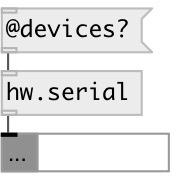

[index](index.html) :: [hw](category_hw.html)
---

# hw.serial

###### serial port device

*available since version:* 0.5

---

## arguments:

* **RATE**
serial baud rate 
_type:_ int 

* **PORT**
serial device or port name, eg.: COM3 on Windows, /dev/ttyACM0 on Linux and
/dev/cu.usbmodem411 on MacOSX 
_type:_ symbol 

## methods:

* **open**
connect to device 

* **close**
disconnect from device 

## properties:

* **@port** 
Get/set name of serial port, eg.: COM3 on Windows, /dev/ttyACM0 on Linux and
/dev/cu.usbmodem411 on MacOSX 
_type:_ symbol 

* **@rate** 
Get/set serial baud rate. Standard value supported by most serial ports: 110, 300, 600,
1200, 2400, 4800, 9600, 14400, 19200, 28800, 38400, 56000, 57600, 115200 
_type:_ int 
_min value:_ 0 
_default:_ 57600 

* **@devices** (readonly)
Get list of found serial devices 
_type:_ list 

## inlets:

* sends float value in byte range [0-255] to serial port 
_type:_ control

## outlets:

* outputs received byte from serial port 
_type:_ control

## keywords:

[serial](keywords/serial.html)

**Authors:** Serge Poltavsky

**License:** GPL3 or later

