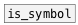

[< reference home](index.html)
---

# is_any


checks if input data has *any* type

---

<br>


---


```


[message( [1( [symbol a( [list a b c(
|         |   |        ___/
[is_any                ]
|     ^|
[tgl]  [print passed]

                
            
```

---
arguments:


---
properties:


---
see also:<br>
[](is_bang.html)
[](is_float.html)
[](is_symbol.html)
[](is_list.html)
