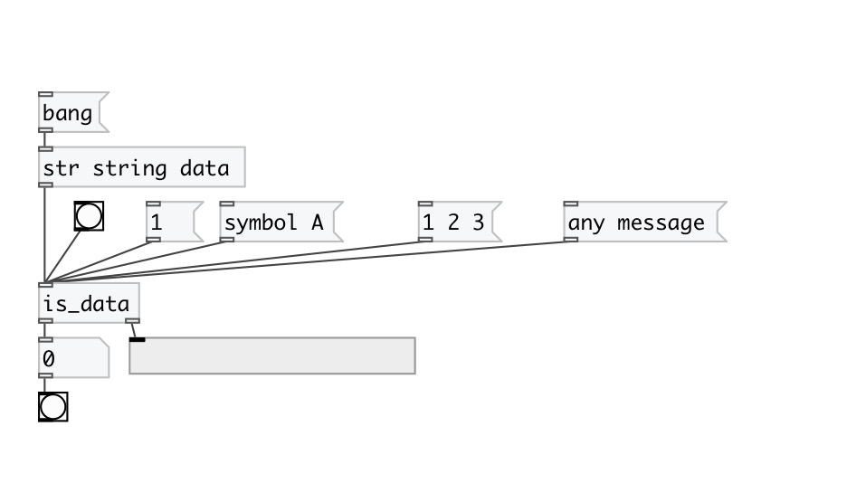

[< reference home](index.html)
---

# is_data

checks if input data has *data* type

---

 

---

---
arguments:

---
properties:

@in_list: output &#39;1&#39; is list contains at least one data
            atom 

---
see also: 

