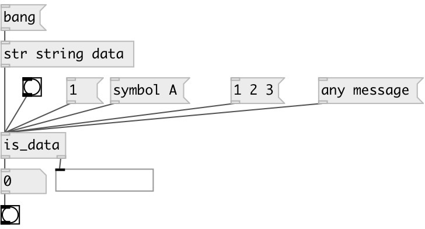

[index](index.html) :: [predicates](category_predicates.html)
---

# is_data

###### checks if input data has *data* type

*available since version:* 0.6

---

## properties:

* **@in_list** 
Get/set output &#39;1&#39; is list contains at least one data atom 
__type:__ flag 
__default:__ 0 

## inlets:

* outputs &#39;1&#39; to 1st outlet, otherwise &#39;0&#39; 
__type:__ control 

## outlets:

* 0 or 1
__type:__ control 
* passes *data* message
__type:__ control 

## keywords:

[predicate](keywords/predicate.html)
[data](keywords/data.html)

**See also:**
[\[is_float\]](is_float.html)
[\[is_symbol\]](is_symbol.html)
[\[is_list\]](is_list.html)

**Authors:** Serge Poltavsky

**License:** GPL3 or later

