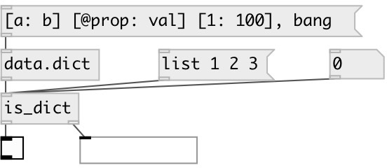

[index](index.html) :: [predicates](category_predicates.html)
---

# is_dict

###### checks if input data has *dict* type

*available since version:* 0.7

---

## inlets:

* input 
_type:_ control

## outlets:

* 0 or 1 
_type:_ control
* passes *dict* 
_type:_ control

## keywords:

[dictionary](keywords/dictionary.html)

**See also:**
[\[data.dict\]](data.dict.html)

**Authors:** Serge Poltavsky

**License:** GPL3 or later

