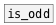

[< reference home](index.html)
---

# is_even


checks if input number is even

---

<br>


---


```


[F]
|
[is_even     ]
|    ^|
[_]  [F]

            
```

---
arguments:


---
properties:


---
see also:<br>
[](is_odd.html)
