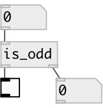

[index](index.html) :: [predicates](category_predicates.html)
---

# is_odd

###### checks if input number is odd

*available since version:* 0.1

---

## inlets:

* outputs &#39;1&#39; if number is not a multiple of two, otherwise outputs
                &#39;0&#39;. 
__type:__ control 

## outlets:

* 0 or 1
__type:__ control 
* passed odd numbers
__type:__ control 

## keywords:

[predicate](keywords/predicate.html)
[numbers](keywords/numbers.html)

**See also:**
[\[is_even\]](is_even.html)

**Authors:** Serge Poltavsky

**License:** GPL3 or later

