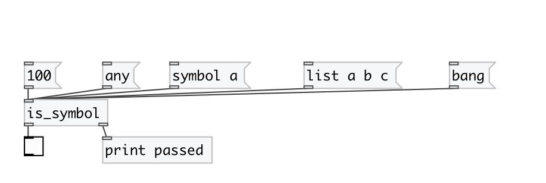

[index](index.html) :: [predicates](category_predicates.html)
---

# is_symbol

###### checks if input data has *symbol* type

*available since version:* 0.1

---

## inlets:

* outputs &#39;1&#39; to 1st outlet, otherwise &#39;0&#39; 
_type:_ control

## outlets:

* 0 or 1 
_type:_ control
* passes *symbol* message 
_type:_ control

## keywords:

[predicate](keywords/predicate.html)
[symbol](keywords/symbol.html)

**See also:**
[\[is_any\]](is_any.html)
[\[is_bang\]](is_bang.html)
[\[is_list\]](is_list.html)
[\[is_float\]](is_float.html)

**Authors:** Serge Poltavsky

**License:** GPL3 or later

