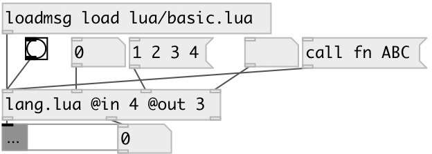

[index](index.html) :: [lang](category_lang.html)
---

# lang.lua

###### Lua JIT language bindings

*available since version:* 0.9.5

---

## information
Lua code is executed in separated thread in async mode. Each lang.lua object has own independent context.

## arguments:

* **IN**
number of inputs 
_type:_ int 

* **OUT**
number of outputs 
_type:_ int 

## methods:

* **load**
load lua file and eval it 
  __parameters:__
  - **PATH** path to lua file 
    type: list  
    required: True  

* **eval**
eval lua code 
  __parameters:__
  - **CODE** lua code 
    type: list  
    required: True  

* **quit**
abort lua script execution 

* **call**
call lua function 
  __parameters:__
  - **FN** function name 
    type: symbol  
    required: True  

  - **[ARGS]** function arguments 
    type: list  

## properties:

* **@in** (initonly)
Get/set number of inputs 
_type:_ int 
_range:_ 1..16 
_default:_ 1 

* **@out** (initonly)
Get/set number of outputs 
_type:_ int 
_range:_ 1..16 
_default:_ 1 

## inlets:

* first lua input 
_type:_ control
* ... lua input 
_type:_ control
* n-th lua input 
_type:_ control

## outlets:

* first lua output 
_type:_ control
* ... lua output 
_type:_ control
* n-th lua output 
_type:_ control

## keywords:

[lua](keywords/lua.html)
[jit](keywords/jit.html)

**Authors:** Serge Poltavsky

**License:** GPL3 or later

