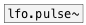

[< reference home](ceammc_lib.html)
---

# lfo.+pulse~


Unit-amplitude nonnegative low frequency pulse train

---

<br>


---


```


[osc.saw~ 1200] [F]    [ui.knob] [ui.dsp~]
|               |      |
|               |      |
|               |      [@duty $1(
|               |      |
|               [lfo.+pulse~ 3 0.1]
|   .___________/
[*~]
|
[ui.gain~ @size 120 14]
|\
[dac~]

            
```

---
arguments:

freq(Hz): frequency<br>
duty: duty cycle<br>

---
properties:

@duty: duty
            cycle<br>
@active: on/off dsp
            processing<br>

---
see also:<br>
[](lfo.pulse~.html)
[](lfo.+square~.html)
[](lfo.impulse~.html)
