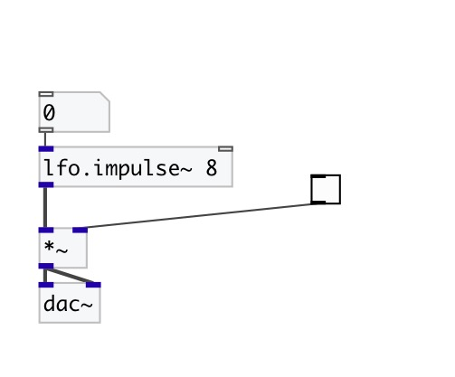

[< reference home](index.html)
---

# lfo.impulse~

Unit-amplitude low-frequency impulse train

---

 

---

---
arguments:

freq(Hz): frequency 

---
properties:

@active: on/off dsp
            processing 

