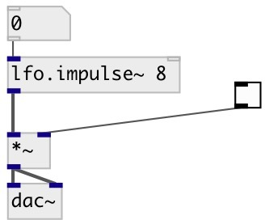

[index](index.html) :: [lfo](category_lfo.html)
---

# lfo.impulse~

###### Unit-amplitude low-frequency impulse train

*available since version:* 0.1

---

## arguments:

* **freq**
frequency 
__type:__ float 
__units:__ Hz 

## properties:

* **@active** 
Get/set on/off dsp processing 
__type:__ int 
__enum:__ 0, 1 
__default:__ 1 

## inlets:

* frequency in Hz 
__type:__ audio 

## outlets:

* output signal
__type:__ audio 

## keywords:

[lfo](keywords/lfo.html)
[oscillator](keywords/oscillator.html)

**Authors:** Serge Poltavsky

**License:** GPL3 or later

