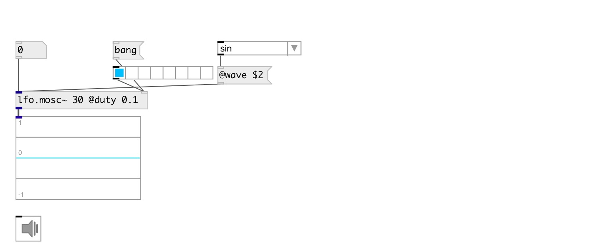

[index](index.html) :: [lfo](category_lfo.html)
---

# lfo.mosc~

###### multi-oscillator with various waveforms

*available since version:* 0.9.3

---

## information
switching between waveforms is interpolated and takes 50ms.

## arguments:

* **FREQ**
frequency 
_type:_ float 
_units:_ Hz 

* **WAVE**
wave type 
_type:_ symbol 

## methods:

* **reset**
reset to initial state 

## properties:

* **@duty** 
Get/set duty cycle for pulse waveform 
_type:_ float 
_range:_ 0..1 
_default:_ 0.5 

* **@pause** 
Get/set pause oscillator at current value 
_type:_ bool 
_default:_ 0 

* **@phase** 
Get/set initial phase 
_type:_ float 
_range:_ 0..1 
_default:_ 0 

* **@windex** 
Get/set waveform index (counting from 0): sin, saw, tri, sqr, pulse, +sin, +saw, +tri,
+sqr, +pulse. 
_type:_ int 
_range:_ 0..9 
_default:_ 0 

* **@wave** 
Get/set wave type 
_type:_ symbol 
_enum:_ sin, saw, tri, sqr, pulse, +sin, +saw, +tri, +sqr, +pulse 
_default:_ sin 

* **@active** 
Get/set on/off dsp processing 
_type:_ bool 
_default:_ 1 

* **@osc** (initonly)
Get/set OSC server name to listen 
_type:_ symbol 

* **@id** (initonly)
Get/set OSC address id. If specified, bind all properties to /ID/lfo_mosc/PROP_NAME osc
address, if empty bind to /lfo_mosc/PROP_NAME. 
_type:_ symbol 

## inlets:

* frequency in Hz 
_type:_ audio
* reset phase 
_type:_ control

## outlets:

* oscillator output 
_type:_ audio

## keywords:

[lfo](keywords/lfo.html)
[oscillator](keywords/oscillator.html)

**See also:**
[\[lfo.square~\]](lfo.square~.html)
[\[lfo.saw~\]](lfo.saw~.html)

**Authors:** Serge Poltavsky

**License:** GPL3 or later

