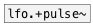

[< reference home](ceammc_lib.html)
---

# lfo.pulse~


Full-range unit-amplitude low frequency pulse train

```


[osc.saw~ 100]          [ui.knob]
|                       |
[ui.gain~ @size 120 14] |
|                       |
|              [F]      [@duty $1(
|              |        |
|              [lfo.pulse~ 6]
|          .___/
[pan.linsig~]    [ui.dsp~]
|  ^|.
[dac~]

            
```

---
arguments:

freq(Hz): frequency<br>
duty: duty cycle<br>

---
properties:

@duty: duty
            cycle<br>
@active: on/off dsp
            processing<br>

---
see also:<br>
[](lfo.+pulse~.html)
[](lfo.square~.html)
[](lfo.impulse~.html)
