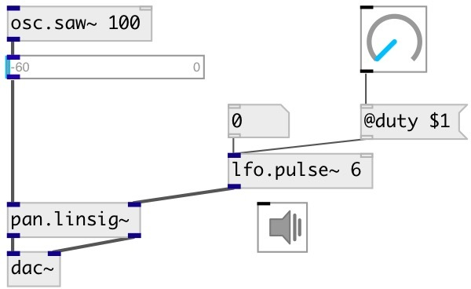

[index](index.html) :: [lfo](category_lfo.html)
---

# lfo.pulse~

###### Full-range unit-amplitude low frequency pulse train

*available since version:* 0.6

---

## arguments:

* **freq**
frequency 
__type:__ float 
__units:__ Hz 

* **duty**
duty cycle 
__type:__ float 

## methods:

* **reset**
reset to initial state 

## properties:

* **@duty** 
Get/set duty cycle 
__type:__ float 
__range:__ 0..1 
__default:__ 0.5 

* **@pause** 
Get/set pause oscillator at current value 
__type:__ int 
__enum:__ 0, 1 
__default:__ 0 

* **@phase** 
Get/set initial phase 
__type:__ float 
__range:__ 0..1 
__default:__ 0 

* **@active** 
Get/set on/off dsp processing 
__type:__ int 
__enum:__ 0, 1 
__default:__ 1 

## inlets:

* frequency in Hz 
__type:__ audio 
* reset phase 
__type:__ control 

## outlets:

* pulsetrain wave in [-1, +1] range
__type:__ audio 

## keywords:

[lfo](keywords/lfo.html)
[oscillator](keywords/oscillator.html)
[pulse](keywords/pulse.html)
[train](keywords/train.html)

**See also:**
[\[lfo.+pulse~\]](lfo.%2Bpulse~.html)
[\[lfo.square~\]](lfo.square~.html)
[\[lfo.impulse~\]](lfo.impulse~.html)

**Authors:** Serge Poltavsky

**License:** GPL3 or later

