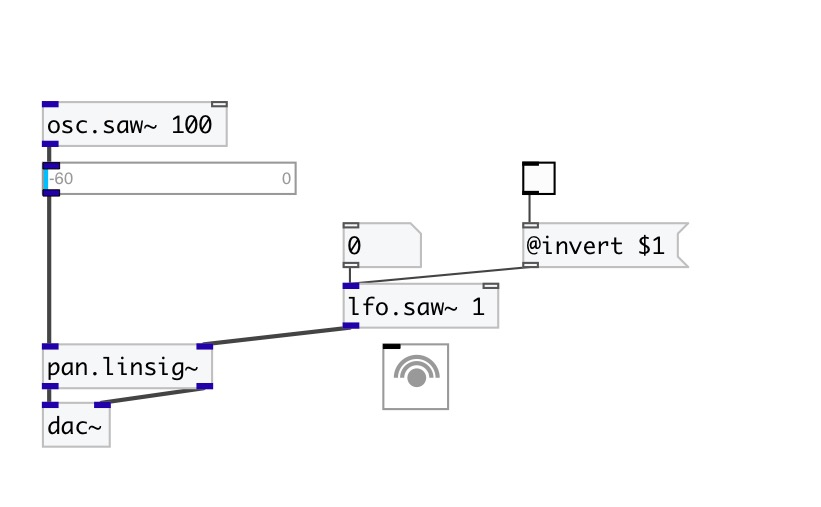

[< reference home](index.html)
---

# lfo.saw~

Full-range unit-amplitude low frequency saw

---

 

---

---
arguments:

freq(Hz): frequency 
invert: duty cycle 

---
properties:

@invert: wave inversion 
@active: on/off dsp
            processing 

---
see also: 

