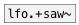

# lfo.saw~

```


[osc.saw~ 100]
|
[ui.gain~ @size 120 14] [T]
|                       |
|              [F]      [@invert $1(
|              |        |
|              [lfo.saw~ 1]
|          .___/
[pan.linsig~]    [ui.dsp~]
|  ^|.
[dac~]

            
```
---
arguments:

freq(Hz): frequency<br>
invert: duty cycle<br>

---
properties:

@invert: wave inversion<br>
@active: on/off dsp
            processing<br>

see also:<br>



